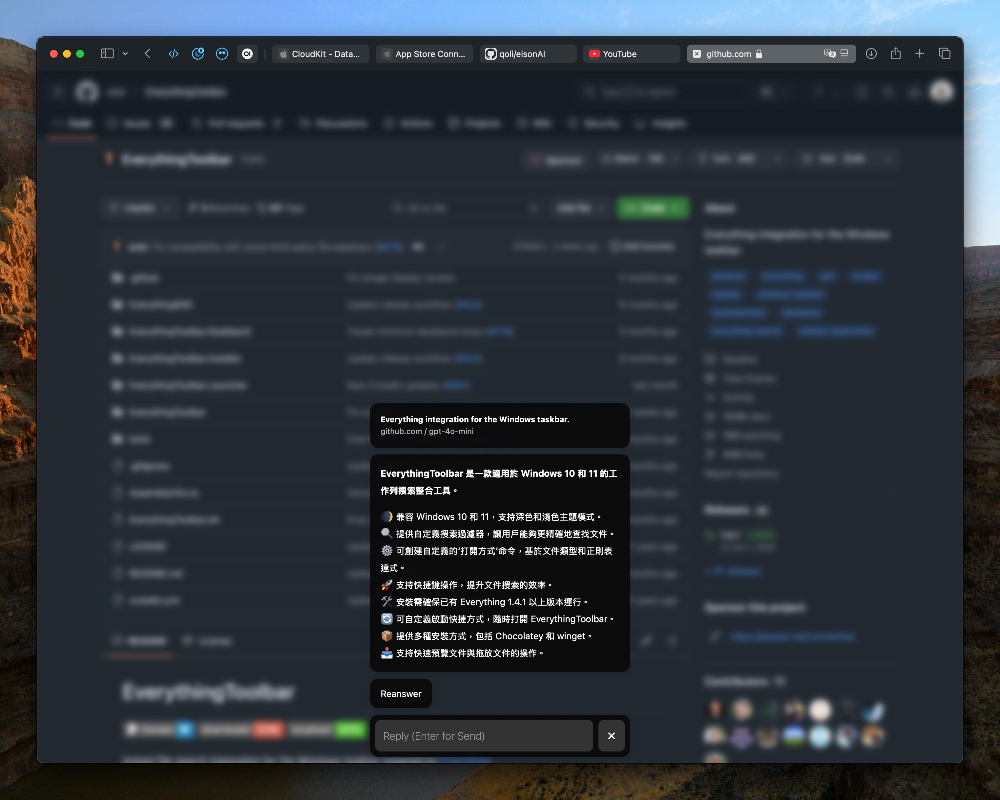

# EisonAI

EisonAI 是一個智能的 Safari 瀏覽器插件，使用先進的大語言模型（LLM）技術來自動總結網頁內容。它能夠智能提取網頁的主要內容，並生成精確的摘要，幫助用戶快速理解網頁要點。

## 功能特點

- **智能內容提取**：使用 Readability 技術自動識別和提取網頁的主要內容
- **AI 智能總結**：使用大語言模型生成網頁內容的精確摘要
- **互動式對話**：支持與 AI 進行多輪對話，深入探討網頁內容
- **優雅的界面**：
  - 迷你浮動按鈕，不影響網頁瀏覽
  - 簡潔的對話框設計
  - 支持明暗主題自適應
  - 打字機效果的訊息顯示
  - 響應式 UI 設計
- **靈活的顯示模式**：
  - 迷你圖標模式：在頁面角落顯示小圖標
  - 隱藏模式：完全隱藏，通過快捷鍵喚出
- **進階功能**：
  - 支援鍵盤快捷操作（Enter 發送）
  - 訊息去重和狀態管理
  - 智能文本長度限制
  - 多平台自適應（iOS/macOS）



## 系統架構

### 核心模組

1. **Content Script (content.js)**
   - 網頁內容提取與處理
   - UI 元素動態注入
   - 消息處理系統
   - GPT 整合
   - 事件監聽與處理

2. **彈出視窗 (popup)**
   - 使用者控制面板
   - API 狀態管理
   - 模式切換介面
   - 跨頁面通訊

3. **設置頁面 (settings)**
   - API 配置管理
   - 提示詞（Prompt）設置
   - 本地存儲處理
   - 安全性控制

### 技術特點

- 使用 Readability.js 進行網頁內容解析
- 模組化的事件處理系統
- CSP (Content Security Policy) 安全控制
- 本地存儲的持久化管理
- 響應式設計與深色模式支援

## 系統要求

- macOS 12.0 或更高版本（用於 macOS Safari 插件）
- iOS 15.0 或更高版本（用於 iOS Safari 插件）
- Safari 15.0 或更高版本

## 安裝方法

1. 從 testflight 下載 EisonAI https://testflight.apple.com/join/1nfTzlPS
2. 在 Safari 設定中啟用 EisonAI 插件：
   - 打開 Safari 偏好設定
   - 點擊「擴展」標籤
   - 勾選 EisonAI 插件

## 使用方法

1. **開啟總結**：
   - 點擊瀏覽器右下角的 EisonAI 圖標
   - 或使用配置的快捷鍵

2. **查看摘要**：
   - 插件會自動提取頁面內容
   - 使用 AI 生成內容摘要
   - 顯示網頁標題和來源信息

3. **深入對話**：
   - 在對話框中輸入問題
   - 按 Enter 發送
   - 與 AI 進行多輪對話，深入探討內容

4. **重新生成**：
   - 如果對摘要不滿意，可以點擊 "Reanswer" 重新生成
   - 系統會重新分析網頁內容並生成新的摘要

## 開發指南

### 環境設置

1. 克隆倉庫：
```bash
git clone https://github.com/yourusername/eisonAI.git
cd eisonAI
```

2. 安裝依賴：
```bash
bundle install
```

3. 開啟 Xcode 項目：
```bash
open eisonAI.xcodeproj
```

### 核心依賴

- browser API
- Readability.js
- contentGPT.js
- popup.css

### 開發注意事項

1. API 設置相關：
   - 必須使用 HTTPS
   - URL 需符合特定格式 (https://example.com/v1)
   - 必須進行 API 驗證測試

2. 程式碼規範：
   - 使用模組化設計
   - 實作適當的錯誤處理
   - 注意跨平台兼容性
   - 遵循 CSP 安全準則

## 貢獻指南

歡迎貢獻！請查看 [CONTRIBUTING.md](CONTRIBUTING.md) 了解如何參與項目開發。

## 行為準則

本項目遵循 [行為準則](CODE_OF_CONDUCT.md)，請所有參與者遵守。

## 關聯項目

### [newSafari](https://github.com/qoli/newSafari)

newSafari 是一個相似的 Safari 網頁內容擷取與總結工具，提供以下特點：

- **基本擷取模式**：
  - 自動獲取當前 Safari 頁面的 URL 和標題
  - 智能清理 HTML 內容，提取純文本
  - 使用 LLM 處理頁面內容
  - 自動保存為 Markdown 文件
  - 支援一鍵複製到剪貼板

- **互動式總結模式**：
  - 自動提取網頁主要內容
  - 生成結構化摘要
  - 支援互動式問答
  - 支援流式輸出
  - 智能對話記憶上下文

兩個專案都致力於提升 Safari 瀏覽器的閱讀體驗，但採用不同的技術實現方案：
- EisonAI 使用瀏覽器擴展形式，直接整合進 Safari
- newSafari 採用獨立應用程式方式，通過 Python 實現

## 許可證

本項目基於 MIT 許可證開源 - 查看 [LICENSE](LICENSE) 文件了解更多信息。